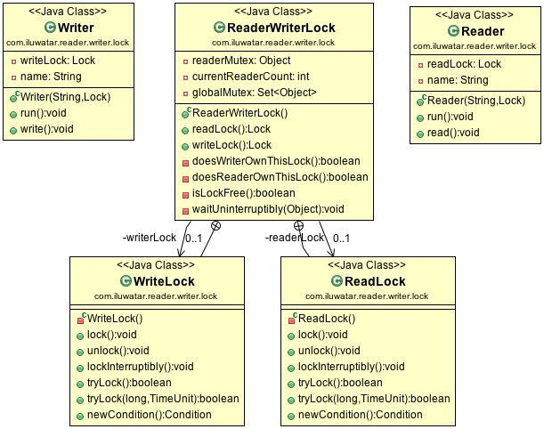

## Intent  

Suppose we have a shared memory area with the basic constraints detailed above. It is possible to protect the shared data behind a mutual exclusion mutex, in which case no two threads can access the data at the same time. However, this solution is suboptimal, because it is possible that a reader R1 might have the lock, and then another reader R2 requests access. It would be foolish for R2 to wait until R1 was done before starting its own read operation; instead, R2 should start right away. This is the motivation for the Reader Writer Lock pattern.

## Class diagram

## Applicability  

Application need to  increase the performance of resource synchronize for multiple thread, in particularly there are mixed read/write operations.

## Real world examples

* [Java Reader Writer Lock](https://docs.oracle.com/javase/7/docs/api/java/util/concurrent/locks/ReadWriteLock.html)

## Credits

* [Readers–writer lock](https://en.wikipedia.org/wiki/Readers%E2%80%93writer_lock)

* [Readers–writers_problem](https://en.wikipedia.org/wiki/Readers%E2%80%93writers_problem)