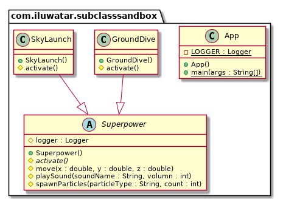

---  
layout: pattern  
title: Subclass Sandbox 
folder:  subclass-sandbox  
permalink: /patterns/subclass-sandbox/  
categories: Other  
tags:  
 - Java  
 - Difficulty-Beginner  
---  

## Intent  
The subclass sandbox pattern describes a basic idea, while not having a lot of detailed mechanics. You will need the pattern when you have several similar subclasses. If you have to make a tiny change, then change the base class, while all subclasses shouldn't have to be touched. So the base class has to be able to provide all of the operations a derived class needs to perform.
  
## Class diagram

  
## Applicability  
The Subclass Sandbox pattern is a very simple, common pattern lurking in lots of codebases, even outside of games. If you have a non-virtual protected method laying around, you’re probably already using something like this. Subclass Sandbox is a good fit when:

-   You have a base class with a number of derived classes.
    
-   The base class is able to provide all of the operations that a derived class may need to perform.
    
-   There is behavioral overlap in the subclasses and you want to make it easier to share code between them.
    
-   You want to minimize coupling between those derived classes and the rest of the program.
  
## Credits  
  
* [Game Programming Patterns - Subclass Sandbox]([http://gameprogrammingpatterns.com/subclass-sandbox.html](http://gameprogrammingpatterns.com/subclass-sandbox.html))